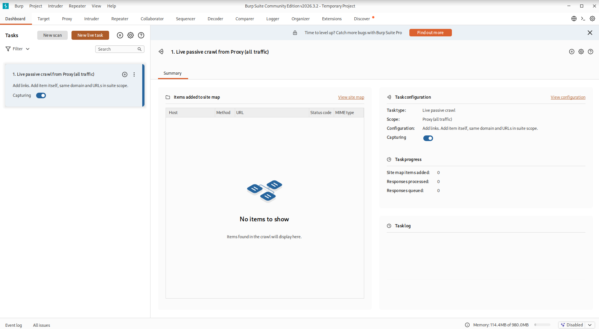
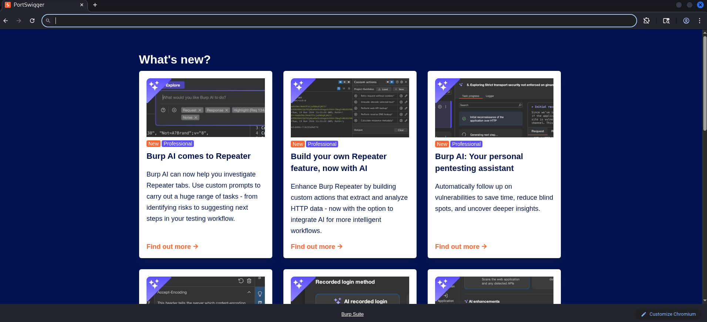
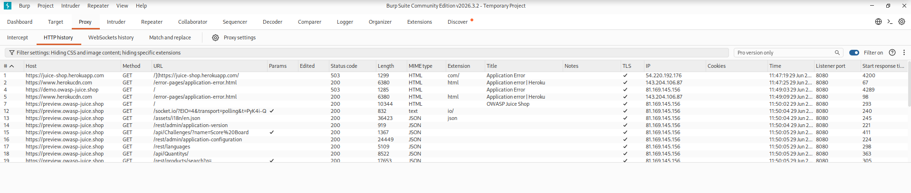
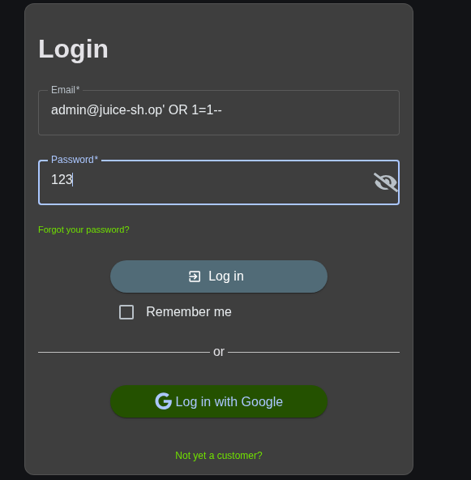
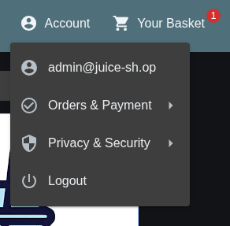
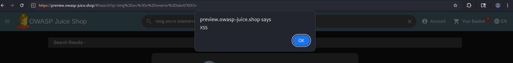
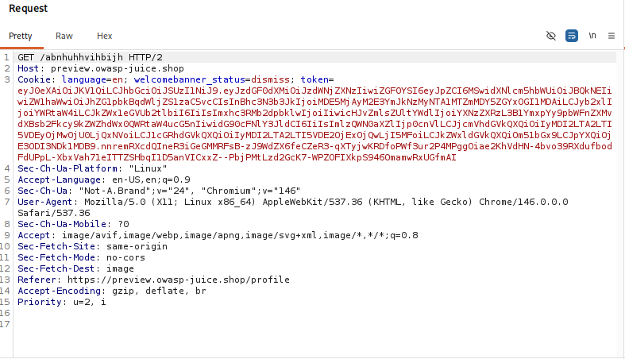

# Web Application Penetration Testing 

## What is this Project?
This project is a step-by-step guide showing how to find common security flaws in a website. Using a popular cybersecurity tool called **Burp Suite Community Edition**, we tested a practice website called **OWASP Juice Shop** to find three major vulnerabilities: **SQL Injection (SQLi)**, **Cross-Site Scripting (XSS)**, and **Cross-Site Request Forgery (CSRF)**.

---

## 🛠️ Phase 1: Setting Up the Tools

### Step 1: Open Burp Suite
Burp Suite is a tool that intercepts and looks at the internet traffic flowing between your computer and the website you are testing. Start a temporary project to open the main dashboard.


### Step 2: Open the Built-in Browser
Go to the **Proxy** tab and click **Open Browser**. This opens a special browser that automatically sends all web data directly into Burp Suite so you can watch it.


### Step 3: Visit the Target Website
In the built-in browser, type in your practice link (`https://preview.owasp-juice.shop`). As the page loads, you will see a list of files and links filling up your **HTTP history** tab. This means Burp Suite is successfully mapping the website's background structure.


---

## 🔍 Phase 2: Finding and Exploiting Vulnerabilities

### 1. Bypassing the Login Page (SQL Injection)
* **What it means:** SQL Injection happens when a database gets confused and treats what you type into a login box as a direct command instead of plain text.
* **How to do it:** 
  1. Go to the login page of the Juice Shop.
  2. In the Email field, type this magic trick text: `admin@juice-sh.op' OR 1=1--`
  3. Type anything into the password field and click **Log in**.

* **The Result:** The database reads `OR 1=1` (which is always true) and automatically logs us straight into the very first account in the system—the administrator—without needing a real password!


---

### 2. Making Code Pop Up (Cross-Site Scripting / XSS)
* **What it means:** XSS happens when a website lets an attacker type custom programming code (JavaScript) into a text box, and the website accidentally runs that code inside the user's browser.
* **How to do it:** 
  1. Click on the **Search** bar at the top of the shop.
  2. Normal `<script>` tags are blocked by modern website security defenses. To bypass this, type a broken image code with a backup trick action:
     ```html
     
     ```
  3. Press Enter.


* **The Result:** The browser tries to load an image named `x`. Because `x` does not exist, the image fails to load and immediately triggers the `onerror` instruction, forcing a warning box to pop up on the screen saying **"XSS"**.



---

### 3. Testing for Trick Attacks (Cross-Site Request Forgery / CSRF)
* **What it means:** CSRF happens when a website relies *only* on a login cookie to verify a user. If a user is logged into the shop, their browser holds that login key. If a hacker creates a hidden "fake button" on an entirely different website, clicking that button can secretly force the user's browser to change their account info or spend their money without them knowing.
* **How to do it:** 
  1. While logged in, go to your **Profile** page on the website and update your username or avatar image.
  2. Go back into Burp Suite's **HTTP history** and look for the specific lines where that profile update happened. You will see lines showing `POST /profile` or `POST /profile/image/url`.

  3. Click on that request and look at the text headers inside the **Request** box. 
  4. Notice line 3 below: The website relies purely on a single logged-in tracking cookie (`token=eyJ0eXAi...`). There are **no hidden security tokens** or custom verification keys protecting this change action.


* **The Vulnerability Proof:** Because there are no dynamic anti-CSRF security keys protecting the profile changes, an attacker could host a malicious, hidden form page like this online:
  ```html
  <form action="[https://preview.owasp-juice.shop/profile/image/url](https://preview.owasp-juice.shop/profile/image/url)" method="POST">
    <input type="hidden" name="url" value="[http://attacker.com/fake-avatar.png](http://attacker.com/fake-avatar.png)" />
  </form>
  <script>document.forms[0].submit();</script>
